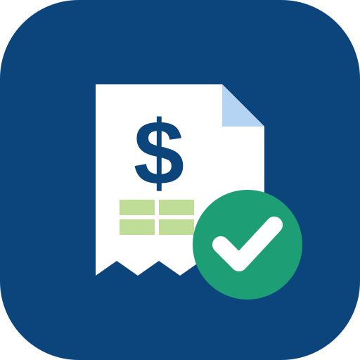

# Expense Report Creator - Releases

Installer downloads and the auto-update feed for **Expense Report Creator**, an offline Windows desktop app that turns your receipts into a finished weekly expense report.

> **For Technic SFT (Surface Finishing Technologies) employees only.** The app ships with the SFT weekly expense form and follows the SFT meal and incidentals policy. It is not a general-purpose expense tool, and it is not an official HR or accounting system. Your manager and accounting still review and approve every report.

## What it does

You drop in your receipts. The app gives you back the two files you normally build by hand:

| Output | What you get |
|---|---|
| **Weekly expense form (`.xls`)** | The genuine SFT weekly form, filled in: week ending, your name, daily amounts per category, totals, advances and net due. It opens in Excel with no repair prompt and prints on one page. |
| **Receipt packet (`.docx`)** | A Word document with your receipts laid out two per row, each captioned (for example `Lunch 09/02/26` or `Flight Receipt`). |

## How it works

1. **Create a report** for the week. The week ending must be a Saturday.
2. **Add receipts.** Drag in photos, screenshots or PDFs, or type an expense in by hand. Every PDF page is shown.
3. **Review each expense** beside its receipt. The app reads the vendor, date and total with on-device OCR. It only suggests values, and anything you type always wins.
4. **Meals and incidentals are handled for you** under the SFT policy: the allowance by default, or the actual amount when a receipt is higher (never both). The $5 incidentals go on the in-between days of a trip, with a tickbox per day to override.
5. **Preview the form** as it will print, then **export** the `.xls` and `.docx` and send them in as usual.

## Install

1. Download **`ExpenseReportCreator-<version>-Setup.exe`** from the [latest release](../../releases/latest). It's the only file you need.
2. Run it. If Windows shows **"Windows protected your PC"**, click **More info → Run anyway**. The app isn't code-signed yet, and every release lists SHA-256 checksums in `SHA256SUMS.txt`.
3. On first launch, enter your name and you're ready. The SFT form and the OCR data are already included, so there's nothing else to download.

No admin rights are needed. The app installs for your Windows user only and updates itself: when a new version is out, you'll see a small "restart to update" prompt.

Full walkthrough: [USER-GUIDE.md](USER-GUIDE.md).

## Privacy

- **Fully offline.** Receipts, reports and exports stay on your PC. There's no account, no cloud, no AI service and no telemetry.
- The only network call is the update check against this repository. If you're offline, everything still works.
- Your data lives in `%APPDATA%\expense-report-creator\` and is kept when you uninstall.

No source code and no user data are stored here.
