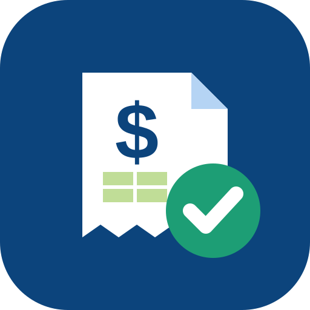

# Expense Report Creator: Releases

Installer downloads, the website and the auto-update feed for **Expense Report Creator**, an offline Windows app that turns your receipts into the finished SFT weekly expense report.

**Website and download:** https://pow3rcycle.github.io/expense-report-creator-releases/

> **For Technic SFT (Surface Finishing Technologies) employees only.** The app ships with the SFT weekly expense form and follows the SFT meal and incidentals policy. It is not an official HR or accounting system; your manager and accounting still review and approve every report.

## What it does

A report is one work order and one week. You drop in the receipts; the app gives you back the two files you used to build by hand, saved into your trip folder:

| File | What you get |
|---|---|
| `Expense form WO <n> week ending <date>.xls` | The genuine SFT weekly form, filled in: week ending, your name, daily amounts per category, totals, advances and net due. Every formula is identical to HR's 2025 template. |
| `Receipts WO <n> week ending <date>.docx` | A Word document with your receipts two per row, each captioned (for example `Lunch 03/03/25` or `Flight Receipt`). |

Three steps: **Receipts and trip**, **Check** (each expense beside its receipt, meals and incidentals), **Save**.

## Install

1. Download **`ExpenseReportCreator-<version>-Setup.exe`** from the [latest release](../../releases/latest). It's the only file you need.
2. Run it. If Windows shows **"Windows protected your PC"**, click **More info**, then **Run anyway**. The app isn't code-signed yet; every release lists SHA-256 checksums in `SHA256SUMS.txt`.
3. Enter your name on first launch. The SFT form and the receipt reader are built in.

No admin rights are needed. The app installs for your Windows user only and updates itself.

Full walkthrough: [USER-GUIDE.md](USER-GUIDE.md).

## Privacy

- **Fully offline.** Receipts, reports and exports stay on your PC. No account, no cloud, no AI service, no telemetry.
- The only network call is the update check against this repository.
- Your data lives in `%APPDATA%\Expense Report Creator\` and is kept when you uninstall.

Windows only. No source code and no user data are stored here.
